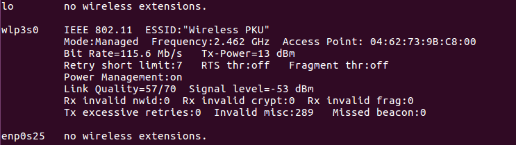
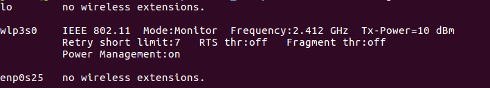
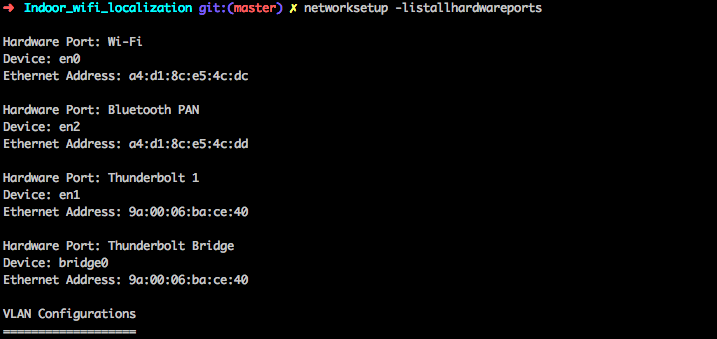

# Indoor_wifi_localization

## 测量RSSI信号数据并建立数据库

### 运行环境说明

- 建议运行环境: Macos, ubuntu 16.x as sudo, python3
- 硬件要求: 支持monitor mode的网卡

### ubuntu 16.x

- 查看所要运行网卡编号

  > iwconfig

  

  如图这里选择wlan网卡**wlp3s0**

- 查看对应无线网卡是否支持**monitor mode**

  > iw list

   

- 修改脚本**setmon.sh**和**unsetmon.sh**,将其中的网卡名称换成对应的网卡名称

- **以管理员身份**执行**setmon.sh**，将网卡配置为**monitor mode**

  > sudo ./setmon.sh

  脚本会要求输入管理员密码，同时会关闭**network-manager**, 即之后无法使用该网卡联网

  运行之后可以执行

  > iwconfig

  确认所要运行的网卡已经处于**monitor mode**

- 配置输入SSID文件，文件中每一行对应一个所要提取rssi的AP的SSID,如下

- 以**管理员身份**运行程序**sniff_rssi.py**, 注意以**python3**执行，执行**sudo python3 sniff_rssi.py -h**查看帮助，示例运行如下

  >sudo python3 sniff_rssi.py --iface wlp3s0 --input ssids.txt --output rssi.json --amount 100

  注意程序会将提取的rssi保存为**json**

  使用 sudo 权限可能导致 python 找不到目标 module，需要调整环境变量，使用一下命令

  >sudo -HE env PATH=$PATH python3 sniff_rssi.py --iface wlp3s0 --input ssids.txt --output rssi.json --amount 100

- 运行完毕关闭**monitor mode**并开启**network-manager**

  > sudo ./unsetmon.sh

### MacOS 

- 查看网卡编号

  > networksetup -listallhardwareports

  

  使用网卡**en0**

- 管理员身份运行**sniff_rssi.py**

  > sudo python3 sniff_rssi.py -i SSIDs.txt -o result.txt -if en0 -a 100 -t test

### 动态查看RSSI

- Linux

  > watch -n 0.2 nmvli dev wifi list

  > sudo iwlist wlp3s0 scan

- MaxOS

  先建立系统 airport 命令的软连接

  > sudo ln -s /System/Library/PrivateFrameworks/Apple80211.framework/Versions/Current/Resources/airport /usr/sbin/airport

  用 grep 和 watch 指令动态获取当前 AP 情况。

  > watch -n 0.5 "airport -s | grep 'Xiaome'"

## 建立预测模型

## 参考资料

### websites & blogs 

- 关于**monitor mode**和一般网卡提取rssi的问题：https://wiki.wireshark.org/CaptureSetup/WLAN#Linux
- 开启**monitor mode**的另一工具: http://www.aircrack-ng.org/doku.php?id=airmon-ng
- MacOS命令行网络设置检查：http://osxdaily.com/2014/09/03/list-all-network-hardware-from-the-command-line-in-os-x/
- 8 Linux Commands: To Find Out Wireless Network Speed, Signal Strength And Other Information: https://www.cyberciti.biz/tips/linux-find-out-wireless-network-speed-signal-strength.html

### papers
